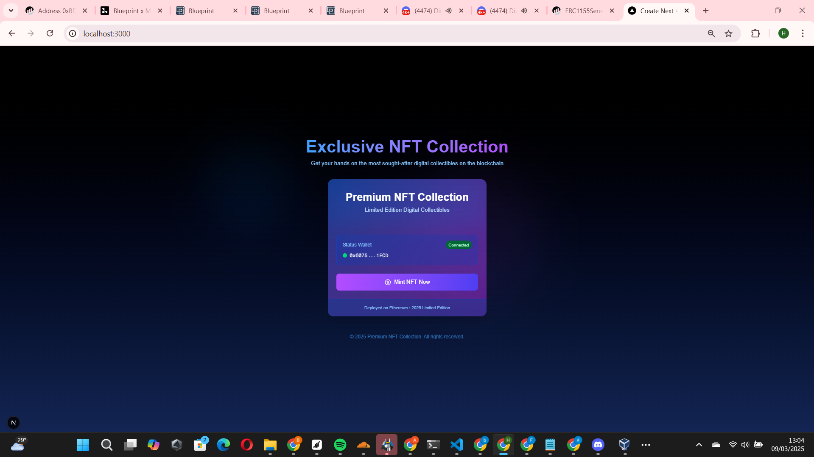

# Script Minting NFT untuk Web3

Script JavaScript sederhana untuk implementasi fungsionalitas minting NFT pada website menggunakan Next.js dan ethers.js. Kode ini dapat diintegrasikan ke dalam proyek web untuk menambahkan kemampuan minting NFT.


## 📋 Deskripsi

Script ini berisi komponen React untuk:
- Menghubungkan website ke wallet MetaMask
- Melakukan minting NFT melalui interaksi dengan smart contract
- Mengelola error dan UI selama proses minting

## 💻 Teknologi yang Digunakan

- **Next.js** - Framework React untuk pengembangan web
- **ethers.js** - Library untuk berinteraksi dengan blockchain Ethereum
- **Tailwind CSS** - Framework CSS untuk styling UI

## 🔍 Cara Kerja Script

Script ini terdiri dari dua file utama:

### 1. `MintNFT.js`
Komponen React utama yang menangani:
- Koneksi wallet MetaMask
- Interaksi dengan smart contract
- Estimasi gas untuk transaksi
- Eksekusi fungsi minting
- Penanganan status dan error

### 2. `page.js`
File halaman Next.js yang mengimpor dan merender komponen `MintNFT`.

## 🧩 Fungsi Utama

```javascript
// Koneksi ke wallet
const connectWallet = async () => {
  if (window.ethereum) {
    try {
      const provider = new ethers.BrowserProvider(window.ethereum);
      const signer = await provider.getSigner();
      setWalletAddress(await signer.getAddress());
    } catch (err) {
      console.error("Wallet connection error:", err);
      setError("Gagal connect wallet!");
    }
  } else {
    setError("Install MetaMask dulu!");
  }
};

// Minting NFT
const mintNFT = async () => {
  if (!walletAddress) return setError("Harap connect wallet dulu!");

  try {
    setLoading(true);
    setError(""); // Reset error sebelum transaksi

    const provider = new ethers.BrowserProvider(window.ethereum);
    const signer = await provider.getSigner();
    const contract = new ethers.Contract(contractAddress, abi, signer);

    // Coba estimate gas dulu buat deteksi error sebelum transaksi
    try {
      await contract.mintReserve.estimateGas(
        "0xa8863bf1c8933f649e7b03eb72109e5e187505ea",
        1,
        1
      );
    } catch (gasError) {
      console.error("Estimate Gas Error:", gasError);
      return setError("Estimasi gas gagal. Cek apakah wallet bisa mint NFT!");
    }

    // Jika berhasil estimate, lanjutkan transaksi
    const tx = await contract.mintReserve(
      "0xa8863bf1c8933f649e7b03eb72109e5e187505ea",
      1,
      1
    );
    await tx.wait();

    alert("Mint berhasil!");
  } catch (err) {
    console.error("Minting error:", err);
    setError(err.reason || err.message || "Mint gagal!");
  } finally {
    setLoading(false);
  }
};
```

## 🔧 Cara Menggunakan

1. **Copy script** ke dalam proyek Next.js Anda:
   - Letakkan `MintNFT.js` dalam folder `components/`
   - Gunakan `page.js` di folder `app/` untuk merender komponen

2. **Pasang dependensi yang diperlukan**:
   ```bash
   npm install ethers
   # atau
   yarn add ethers
   ```

3. **Sesuaikan detail smart contract**:
   - Alamat kontrak (`contractAddress`)
   - ABI kontrak (`abi`)
   - Parameter untuk fungsi `mintReserve`

4. **Import dan gunakan komponen** dalam halaman Anda

## ⚠️ Catatan Penting

- Script ini memerlukan instalasi MetaMask pada browser pengguna
- Pengguna harus memiliki ETH untuk biaya gas
- Script secara default terhubung ke mainnet Ethereum, sesuaikan provider jika ingin menggunakan testnet
- Parameter fungsi `mintReserve` perlu disesuaikan dengan kontrak NFT target

## 🌐 Contoh Penggunaan

```javascript
import MintNFT from "@/components/MintNFT";

export default function NftPage() {
  return (
    <div className="container mx-auto py-10">
      <h1 className="text-2xl font-bold mb-5">Minting NFT</h1>
      <MintNFT />
    </div>
  );
}
```
